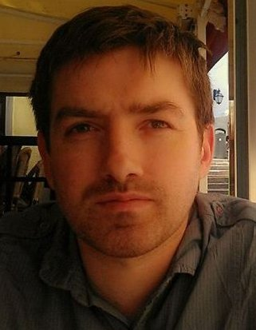

:url: pages/Brian
:save_as: pages/Brian.html

Dr Brian Forde
==============

   

In October 2008 I began my PhD in the lab of Prof. Paul O' Toole at the department of Microbiology, University College Cork 
investigating commensal and environmental motile lactobacilli with an emphasis on *Lactobacillus ruminis*. 
In December 2012 I moved to the Brisbane to take up a post-doctoral position with Dr. Scott Beatson at the University of Queensland. 
Currently my work involves the uses of PacBio SMRT sequencing technology to explore the genomes and epigenomes of multidrug resistant *E. coli* 
and developing methodologies for dealing with this datatype.

Over the last 5 years I have developed a strong research interest in the use of sequencing data and bioinformatics tools to 
investigate the genomes of commensal and pathogenic bacteria, the pangenomes of bacterial communities and cohesive 
phylogenetic groups. In addition, I am keenly interested in the in silico use of sequence data to enhance and 
inform lab based projects by assisting the rapid identification of genetic targets for future investigations and 
identifying candidate species with the potential for desirable industrial and medical applications.
