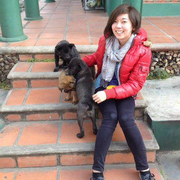

:url: pages/Leah
:save_as: pages/Leah.html

Leah Roberts
=============

I completed my undergraduate degree in Science/Arts at the University of Queensland in 2013, majoring in Microbiology (infectious disease) and Japanese (extended major). I then completed Honours in the Scott Beatson lab in 2014, working on the role of insertion sequences in the recently emerged *Escherichia coli* ST131 lineage. I was awarded the 2013 UQ Microbiology prize, and later in 2014 a UQ University Medal_ for academic achievement in the Bachelor of Science with Honours. I have also participated in several introductory research experiences with Dr Ulrike Kappler, A/Prof James Fraser and A/Prof Scott Beatson.

.. _Medal: http://www.uq.edu.au/myadvisor/university-medals/

I commenced my PhD in April 2015 in the Scott Beatson lab group, focusing on continuing my research into insertion sequences in the ST131 lineage. My interests lie in epidemiology and the study of disease outbreaks, as well as providing a bridge between laboratory clinicians and bioinformaticians. 

My skills are primarily wet lab based, focusing on microbiology and molecular microbiology. I have experience handling both bacteria and yeast, specifically *E. coli*, *Shinorhizobium meliloti* and *Candida albicans*. I have varying skills in programming languages such as python and bash, and have constructed a few simple opensource tools available on Github_. My future aim is to learn more about web development to increase the accessibility of bioinformatics tools to researchers unfamiliar with programming. 

.. _Github: https://github.com/LeahRoberts/
